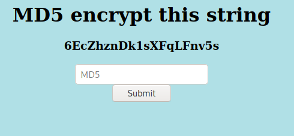
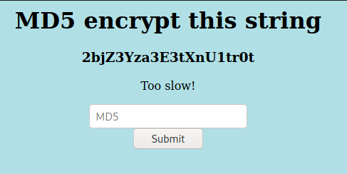
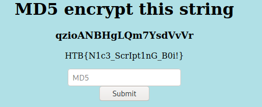

## [](#header-2)Challenge:


Navigating to the IP in our browswer we get:




The challenge here is to be able to submit the md5 encoded string within a very short window of time which can be done with a little scripting.




## [](#header-2)Solution:

Looking at the challenge it became obvious that in order to be fast enough to complete the challenge I would need to automate this process.

The script I wrote used the libraries Selenium and BeautifulSoup as well as hashlib.

```python
# Python program to use selenium and Beautiful Soup to parse/interact with web page

# import webdriver 
from selenium import webdriver 
#import html parser
from bs4 import BeautifulSoup
#import hash library
import hashlib

# create webdriver object 
driver = webdriver.Firefox() 

# get the target website
driver.get("http://167.99.85.197:30369/") 

#save html code in "html" object
html = driver.page_source

soup = BeautifulSoup(html,features="lxml")

#find the txt to be encoded
for tag in soup.find_all('h3'):
  target = tag.text

# encoding the given text using encode() 
# then sending to md5() 
md5 = hashlib.md5(target.encode()) 

#turn hex object to a md5 string
md5String=md5.hexdigest()

#find where to submit our hash
element = driver.find_element_by_name("hash")

#send our input to the webpage
element.send_keys(md5String)


# get submit button element from xpath
submitButton = driver.find_element_by_xpath("/html/body/center/form/input[2]") 

#click submit button
submitButton.click()
```


Within the Script I included comments that explain the process of what the script does but I will also give a small summary:


1. Opens firefox and navigates to target IP
2. Locates and extracts the string to be encoded
3. Encodes the extracted string into a md5 hash
4. Inputs the now encoded string into the submission box and clicks "submit" button


Once we run with python3 emdee-script.py we get the flag.



