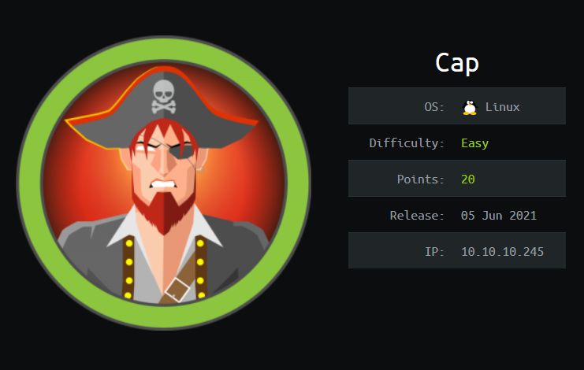

## Table of contents
{: .no_toc .text-delta }

- Summary
- Recon
- Exploitation
- Privilege Escalation
{:toc}

## Summary:

- Modify URL to find "hidden" pcap file
- Inspect pcap file to find cleartext credentials
- Escalate privileges by using "capabilities"

## Recon:

Arriving at the http server we see that it is come type of network monitoring webapp

Looking around the app I found an interesting page that allows you to download internal pcap files

Most files were empty but I noticed that each time the page refreshed a new file was available for download and shown in the url

After trying a couple of different numbers I found the "0" placed pcap file was the most interesting

After inspecting Wireshark I was able to find cleartext credentials for the user "Nathan"

## Exploitation:

With my newly found creds I decided to go ahead and try them via ssh

## Privilege Escalation:

The privesc path that I find mainly from googling <machine name> + priv esc was done using ["capabilities"](https://www.hackingarticles.in/linux-privilege-escalation-using-capabilities/)

Using 

'''bash
getcap -r / 2>/dev/null
'''
To get a list of capability enabled binaries I find that Python3.8 has interesting capabilities

Once I spawn a shell with the python binary with the [setuid](https://www.geeksforgeeks.org/python-os-getuid-and-os-setuid-method/) param == 0 I am able to get a root shell

