## [](#header-2)Summary:

1. Find/Enumerate Samba Shares
2. Use samba share directory hosted on webserver to gain foothold via reverse shell 
3. Use PrintSpoofer exploit for Privesc


## [](#header-2)Recon:

First we'll scan for any services or open ports that may be running/open.

While I'm doing that I navigate to the targetIP in my broswer to see if there is a web application that can provide more information.


The webpage only contains links to Microsofts actual IIS webpage.

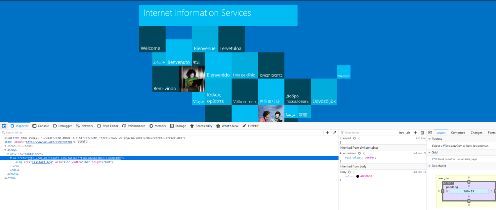


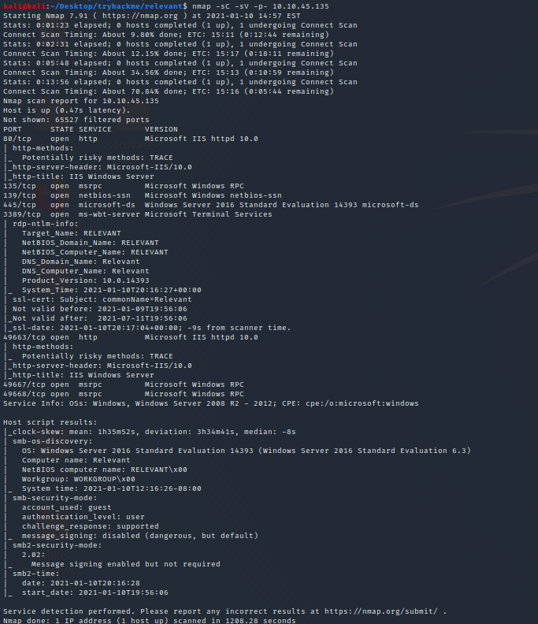
From the nmap results we can see that multiple services running smb(ports 139,445),http(port 80,49663),RPC(ports 135,49667,49668). Since I am somewhat familiar with using smb shares for explotation I'll look into those first.


```bash
kali@kali:~/Desktop/tryhackme/relevant$ smbclient -L //<targetip>/ 
                                                                                                                                                                               
Enter WORKGROUP\kali's password:                                                                                                                                                                                                                           
                                                                                                                                                                                                                                                           
        Sharename       Type      Comment                                                                                                                                                                                                                  
        ---------       ----      -------                                                                                                                                                                                                                  
        ADMIN$          Disk      Remote Admin                                                                                                                                                                                                             
        C$              Disk      Default share                                                                                                                                                                                                            
        IPC$            IPC       Remote IPC                                                                                                                                                                                                               
        nt4wrksv        Disk                                                                                                                                                                                                                               
SMB1 disabled -- no workgroup available  
```

After listing smb shares and trying to log into each I found that "nt4wrksv" was not password protected.

```bash
kali@kali:~/Desktop/tryhackme/relevant$ smbclient //<targetip>/nt4wrksv
Enter WORKGROUP\kali's password: 
Try "help" to get a list of possible commands.
smb: \> dir
```
After analyzing the nt4wrksv share I found a file "passwords.txt" which seems a little too good to be true but alright.
```bash
smb: \> dir
  .                                   D        0  Sat Jul 25 17:46:04 2020
  ..                                  D        0  Sat Jul 25 17:46:04 2020
  passwords.txt                       A       98  Sat Jul 25 11:15:33 2020

smb: \> get passwords.txt
getting file \passwords.txt of size 0 as passwords.txt (0.1 KiloBytes/sec) (average 0.1 KiloBytes/sec)

```

Once I grab the password.txt file and analyzed it I see that there are some possible credentials that have been encoded seemingly with base64(due to the "==")

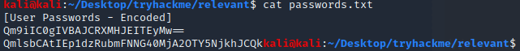

After further decoding with the base64 tool we get two possible usernames and passwords.
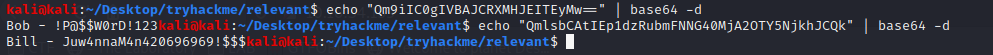

My goal now is to figure out where these usernames can be possibly used. 

While looking for possible areas that the usernames could be used my directory bruteforcing scans with gobuster I found some interesting results.

My initial scans on the target host's default port did not provide any results but when I scanned the host on it's other port running http I found our smb share listed.
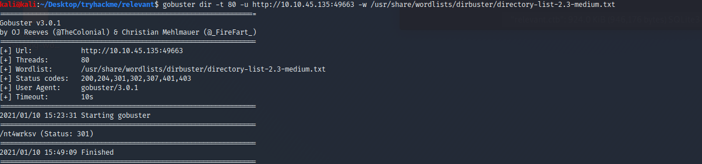

Further navigating to the webpage at http://10.10.45.135:49663/nt4wrksv/passwords.txt we can see that the directory is in fact accessible.
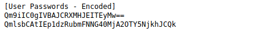


## [](#header-2)Intrusion:

Once I find that I can upload whatever I want to the webserver via the writeable samba share I then think of how this can possibly get me a foothold.
Since the client is running in ASP.net (which we can find through the wappalyer firefox addon) our best bet would be to create a reverse shell in a .net format and upload it to the samaba share folder in the hopes that we can get a connection into the target machine.

Now we generate the shell with the help of msfvenom.
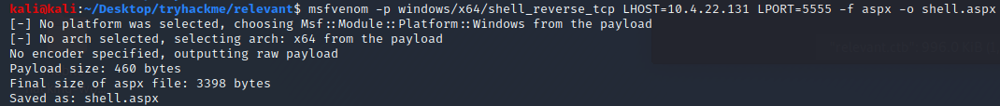

Once that is done all we need to do is use the “put” command to upload our shell on the target host.
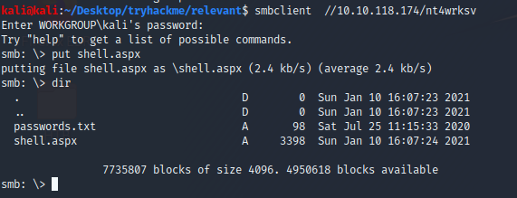

To prepare connection to the shell we use netcat to listen for our shell with the following command:
```bash
nc -lvnp 5555
```


Then we navigate to it in our browser in order to execute the shell on the server.
http://10.10.118.174:49663/nt4wrksv/shell.aspx


and we finally get a shell!
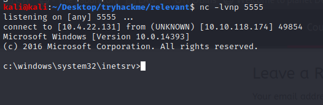

## [](#header-2)Explotation:

Finding the user flag within Bob's desktop folder.


Once we try and navigate to the admin folder we can see that our current permissions don't allow it.
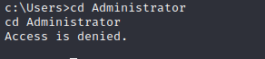


Furthermore we check our current privledges to see if there is any way we can privesc.
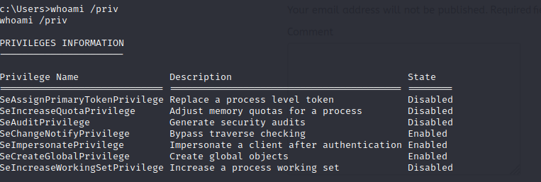


After looking at many possible privesc avenues I found that some techniques involving the SeImpersonatePrivilege would be the best choice.
https://github.com/dievus/printspoofer

I found PrintSpoofer to be the most up to date/convenient tool to use in this case.

To upload this file to our server I uploaded it to the smb share's directory and found the directory within our shell with a quick search
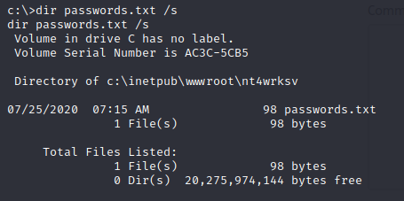


We can then escalate privileges by performing the following commands:
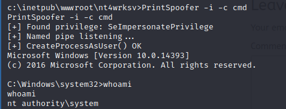

Once this is done our root flag is finally accessible!


